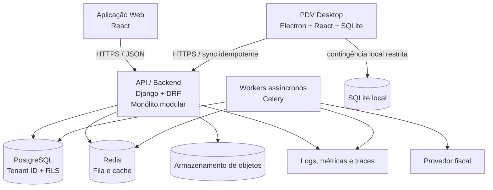

# C4 — Contêineres

**ID:** DIA-002  
**Versão:** 0.1.0  
**Status:** Review

## Regras arquiteturais

- Web e PDV nunca acessam PostgreSQL diretamente.
- Processos demorados e integrações externas são assíncronos quando compatível com a experiência do usuário.
- A Transactional Outbox conecta transações de domínio ao processamento assíncrono.
- SQLite existe apenas no PDV e não substitui o registro central de forma permanente.

