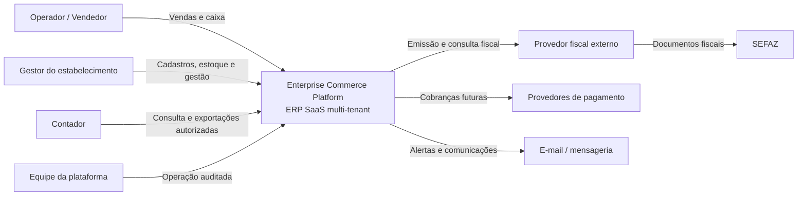

# C4 — Contexto do Sistema

**ID:** DIA-001  
**Versão:** 0.1.0  
**Status:** Review

## Limites

- A plataforma mantém isolamento lógico por `tenant_id`, empresa e filial.
- O provedor fiscal é acessado somente pelo adaptador `FiscalProvider`.
- A SEFAZ não é integrada diretamente no MVP.
- O cliente contrata e configura suas credenciais fiscais no modelo inicial.

