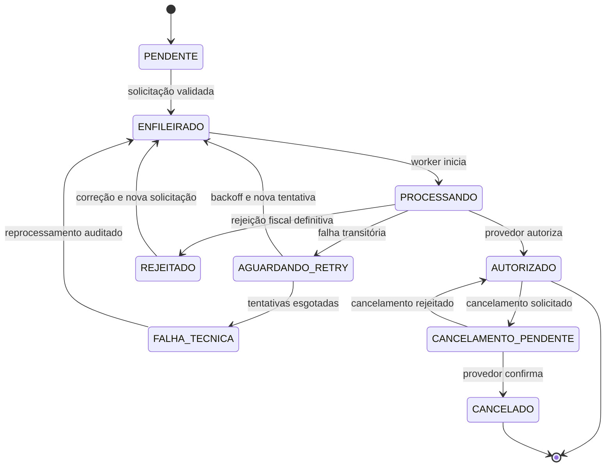

# Fluxo de estados fiscais

**ID:** DIA-005  
**Versão:** 0.1.0  
**Status:** Review

## Regras

- Cada transição registra ator, instante, correlação, tenant, empresa e filial.
- Reprocessamento reutiliza a identidade lógica da solicitação para evitar emissão duplicada.
- Respostas do provedor são armazenadas de forma sanitizada e auditável.
- Estados internos são independentes da nomenclatura específica de qualquer provedor.

