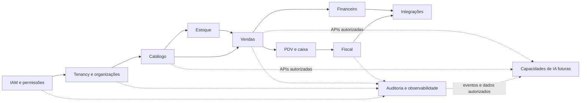

# Dependências entre módulos

**ID:** DIA-003  
**Versão:** 0.1.0  
**Status:** Review

## Restrições

- Dependências seguem contratos públicos de aplicação; módulos não leem tabelas privadas de outros módulos.
- Fiscal depende de vendas concluídas, mas vendas não depende de detalhes de um provedor fiscal.
- IA futura consome APIs, eventos e bases autorizadas; não recebe acesso irrestrito ao banco.

