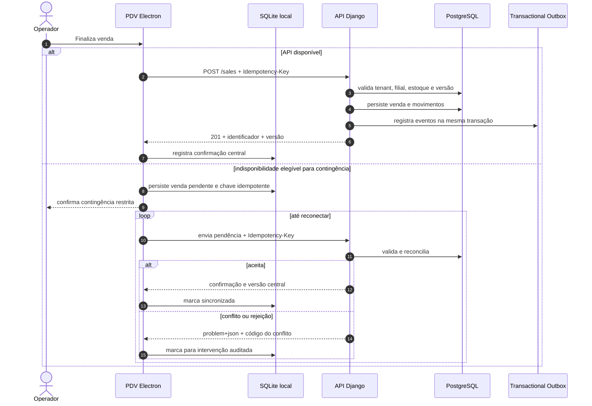

# Sequência de sincronização do PDV

**ID:** DIA-004  
**Versão:** 0.1.0  
**Status:** Review

## Garantias

- Toda tentativa reutiliza a mesma chave de idempotência.
- O modo offline permite apenas operações essenciais previamente autorizadas.
- Conflitos não são descartados silenciosamente e exigem trilha de auditoria.
- Emissão fiscal offline segue as capacidades e regras do provedor contratado.

